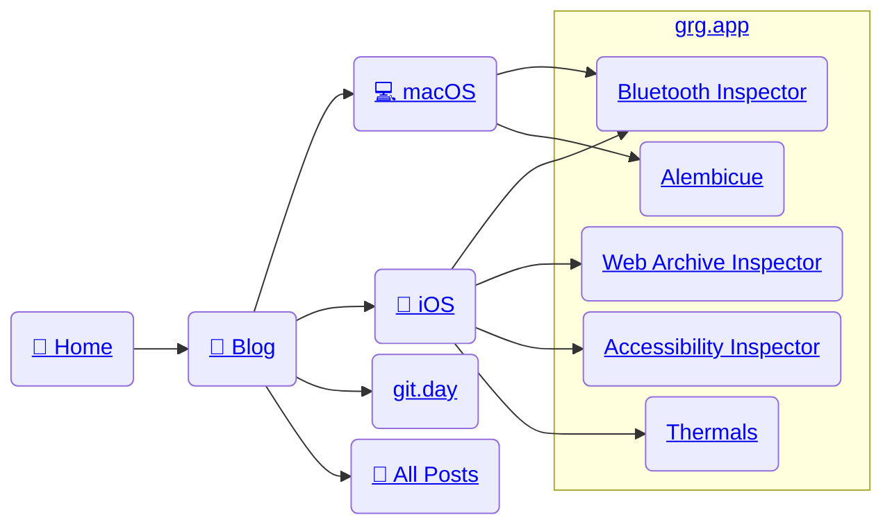

```mermaid
graph LR
%%{init:{'flowchart':{'nodeSpacing': 8, 'rankSpacing': 40}}}%%
Home("<a href=https://georgegarside.com/>🏡 Home</a>")
Blog("<a href=https://georgegarside.com/blog/>📝 Blog</a>")
Apps("<a href=https://georgegarside.com/apps/>🧰 Apps</a>")
Home --> Blog
	Blog --> macOS("<a href=https://georgegarside.com/blog/macos/>💻 macOS</a>")
	Blog --> iOS("<a href=https://georgegarside.com/blog/ios/>📱 iOS</a>")
	Blog --> Git("<a href=https://git.day/>git.day</a>")
	Blog --> Posts("<a href=https://georgegarside.com/blog/>📑 All Posts</a>")
subgraph Apps["<a href=https://grg.app/>grg.app</a>"]
	direction RL
 	BT("<a href=https://georgegarside.com/apps/bluetooth-inspector/>Bluetooth Inspector</a>")
 	WAI("<a href=https://georgegarside.com/apps/web-archive-inspector/>Web Archive Inspector</a>")
 	AI("<a href=https://georgegarside.com/apps/accessibility-inspector/>Accessibility Inspector</a>")
 	Thermals("<a href=https://georgegarside.com/apps/thermals/>Thermals</a>")
 	Alembicue("<a href=https://georgegarside.com/apps/alembicue/>Alembicue</a>")
end
iOS --> BT & WAI & AI & Thermals
macOS --> BT & Alembicue
```
